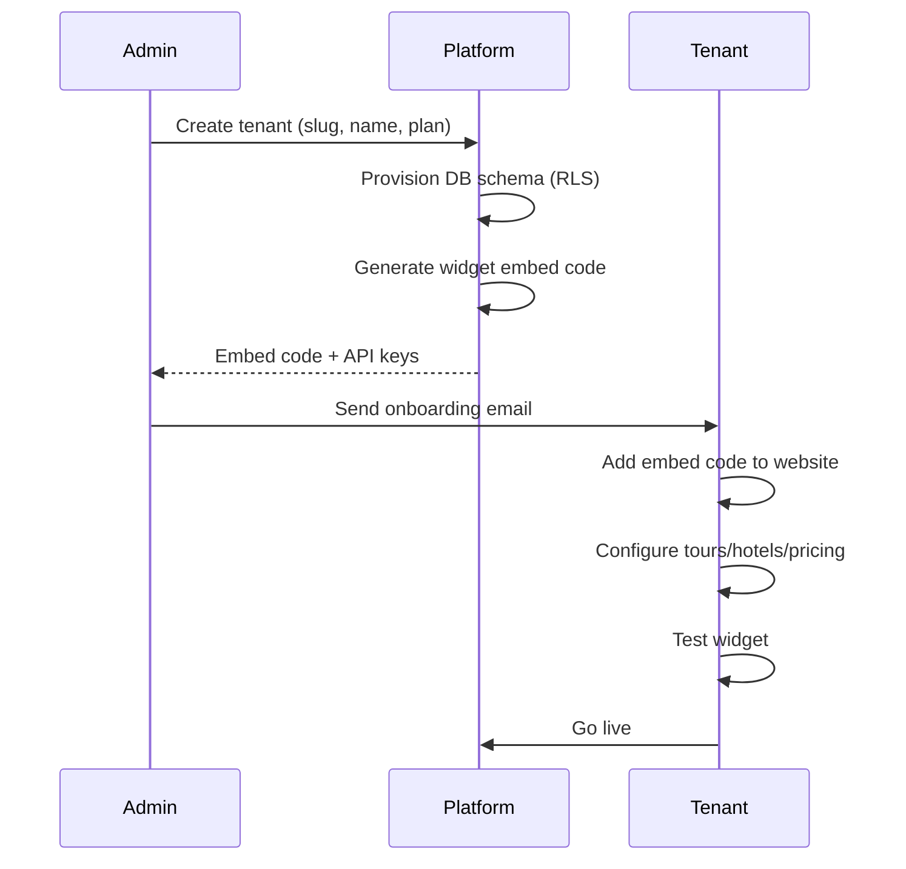

# Sprint 2 Technical Design — Multi-Tenant LankaAgent

**Status:** Design Phase
**Prerequisite:** ≥1 Pilot Signed (Revenue-First Rule)
**Target:** White-label SaaS for Sri Lanka tour operators

---

## 1. Architecture Overview

```
┌─────────────────────────────────────────────────────────────┐
│                      LankaAgent Platform                     │
├─────────────────────────────────────────────────────────────┤
│  ┌──────────────┐  ┌──────────────┐  ┌──────────────┐       │
│  │   Tenant A   │  │   Tenant B   │  │   Tenant N   │       │
│  │ (Ceyloria)   │  │ (Operator X) │  │ (Operator Y) │       │
│  │              │  │              │  │              │       │
│  │ • Branding   │  │ • Branding   │  │ • Branding   │       │
│  │ • Pricing    │  │ • Pricing    │  │ • Pricing    │       │
│  │ • Tours      │  │ • Tours      │  │ • Tours      │       │
│  │ • Widget     │  │ • Widget     │  │ • Widget     │       │
│  └──────┬───────┘  └──────┬───────┘  └──────┬───────┘       │
│         │                 │                 │                │
│         └─────────────────┼─────────────────┘                │
│                           ▼                                  │
│  ┌─────────────────────────────────────────────────────────┐ │
│  │              Shared Platform Services                    │ │
│  │  ┌──────────┐ ┌──────────┐ ┌──────────┐ ┌────────────┐  │ │
│  │  │  Auth    │ │  Billing │ │  MCP     │ │  Widget    │  │ │
│  │  │  (Clerk/ │ │ (Stripe/ │ │ Tourism  │ │  Engine    │  │ │
│  │  │  Auth0)  │ │ PayHere) │ │ Server   │ │ (Multi-    │  │ │
│  │  │          │ │          │ │          │ │  tenant)   │  │ │
│  │  └──────────┘ └──────────┘ └──────────┘ └────────────┘  │ │
│  └─────────────────────────────────────────────────────────┘ │
└─────────────────────────────────────────────────────────────┘
```

---

## 2. Multi-Tenant Data Model

### 2.1 Core Tables (PostgreSQL + RLS)

```sql
-- Tenants (operators)
CREATE TABLE tenants (
    id UUID PRIMARY KEY DEFAULT gen_random_uuid(),
    slug VARCHAR(64) UNIQUE NOT NULL,           -- ceyloria, operator-x
    name VARCHAR(255) NOT NULL,                 -- "Ceyloria Holidays"
    domain VARCHAR(255),                        -- api.ceyloria.com
    logo_url TEXT,
    primary_color VARCHAR(7),                   -- #C9A227
    secondary_color VARCHAR(7),                 -- #062A26
    font_display VARCHAR(100),                  -- 'Cormorant Garamond'
    font_body VARCHAR(100),                     -- 'Manrope'
    plan VARCHAR(32) DEFAULT 'starter',         -- starter, growth, pro, enterprise
    status VARCHAR(32) DEFAULT 'active',        -- active, suspended, trial
    created_at TIMESTAMPTZ DEFAULT NOW(),
    updated_at TIMESTAMPTZ DEFAULT NOW()
);

-- Tenant-specific tour data (isolated by RLS)
CREATE TABLE tenant_tours (
    id UUID PRIMARY KEY DEFAULT gen_random_uuid(),
    tenant_id UUID REFERENCES tenants(id),
    name VARCHAR(255) NOT NULL,
    slug VARCHAR(128),
    description TEXT,
    duration_days INT NOT NULL,
    base_price_usd DECIMAL(10,2),
    meal_plan VARCHAR(32),                      -- HB, FB, AI
    highlights JSONB,                           -- [{day, title, activities}]
    inclusions JSONB,
    exclusions JSONB,
    is_active BOOLEAN DEFAULT true,
    created_at TIMESTAMPTZ DEFAULT NOW()
);

-- Tenant-specific hotels
CREATE TABLE tenant_hotels (
    id UUID PRIMARY KEY DEFAULT gen_random_uuid(),
    tenant_id UUID REFERENCES tenants(id),
    name VARCHAR(255) NOT NULL,
    location VARCHAR(255),
    category VARCHAR(32),                       -- standard, deluxe, luxury
    room_types JSONB,                           -- {standard: 150, deluxe: 200}
    meal_rates JSONB,                           -- {HB: 25, FB: 40, AI: 60}
    images TEXT[],
    is_active BOOLEAN DEFAULT true
);

-- Tenant-specific attractions
CREATE TABLE tenant_attractions (
    id UUID PRIMARY KEY DEFAULT gen_random_uuid(),
    tenant_id UUID REFERENCES tenants(id),
    name VARCHAR(255) NOT NULL,
    province VARCHAR(128),
    category VARCHAR(64),                       -- heritage, wildlife, nature
    fee_usd DECIMAL(10,2),
    description TEXT,
    in_tour BOOLEAN DEFAULT false,
    is_active BOOLEAN DEFAULT true
);

-- Tenant pricing engine config
CREATE TABLE tenant_pricing_config (
    tenant_id UUID PRIMARY KEY REFERENCES tenants(id),
    margin DECIMAL(5,4) DEFAULT 0.2595,         -- 25.95% default
    vehicle_daily_rate DECIMAL(10,2) DEFAULT 140,
    vehicle_daily_rate_group DECIMAL(10,2) DEFAULT 170,
    airport_transfer_total DECIMAL(10,2) DEFAULT 60,
    single_supplement_per_night DECIMAL(10,2) DEFAULT 45,
    peak_season_supplement_per_night DECIMAL(10,2) DEFAULT 45,
    shoulder_supplement_per_night DECIMAL(10,2) DEFAULT 25,
    updated_at TIMESTAMPTZ DEFAULT NOW()
);

-- Widget configuration per tenant
CREATE TABLE tenant_widget_config (
    tenant_id UUID PRIMARY KEY REFERENCES tenants(id),
    welcome_message TEXT,
    primary_color VARCHAR(7),
    secondary_color VARCHAR(7),
    logo_url TEXT,
    supported_languages TEXT[] DEFAULT '{en,de,fr,ru,zh,si,ta}',
    default_language VARCHAR(5) DEFAULT 'en',
    voice_enabled BOOLEAN DEFAULT true,
    whatsapp_enabled BOOLEAN DEFAULT false,
    whatsapp_number VARCHAR(32),
    custom_css TEXT,
    updated_at TIMESTAMPTZ DEFAULT NOW()
);

-- Leads (per tenant, isolated)
CREATE TABLE leads (
    id UUID PRIMARY KEY DEFAULT gen_random_uuid(),
    tenant_id UUID REFERENCES tenants(id),
    session_id VARCHAR(128),
    name VARCHAR(255),
    email VARCHAR(255),
    phone VARCHAR(64),
    country VARCHAR(2),
    language VARCHAR(5) DEFAULT 'en',
    source VARCHAR(64),                         -- widget, whatsapp, api
    status VARCHAR(32) DEFAULT 'new',           -- new, contacted, quoted, booked, lost
    metadata JSONB,
    created_at TIMESTAMPTZ DEFAULT NOW(),
    updated_at TIMESTAMPTZ DEFAULT NOW()
);

-- Conversations (per tenant)
CREATE TABLE conversations (
    id UUID PRIMARY KEY DEFAULT gen_random_uuid(),
    tenant_id UUID REFERENCES tenants(id),
    session_id VARCHAR(128) NOT NULL,
    lead_id UUID REFERENCES leads(id),
    language VARCHAR(5) DEFAULT 'en',
    history JSONB DEFAULT '[]',
    created_at TIMESTAMPTZ DEFAULT NOW(),
    updated_at TIMESTAMPTZ DEFAULT NOW()
);

-- Enable RLS
ALTER TABLE tenant_tours ENABLE ROW LEVEL SECURITY;
ALTER TABLE tenant_hotels ENABLE ROW LEVEL SECURITY;
ALTER TABLE tenant_attractions ENABLE ROW LEVEL SECURITY;
ALTER TABLE tenant_pricing_config ENABLE ROW LEVEL SECURITY;
ALTER TABLE tenant_widget_config ENABLE ROW LEVEL SECURITY;
ALTER TABLE leads ENABLE ROW LEVEL SECURITY;
ALTER TABLE conversations ENABLE ROW LEVEL SECURITY;

-- RLS Policies (tenant isolation)
CREATE POLICY tenant_isolation ON tenant_tours
    USING (tenant_id = current_setting('app.current_tenant_id')::uuid);
-- Repeat for all tenant_* tables
```

---

## 3. API Endpoints (Multi-Tenant)

### 3.1 Tenant Resolution
```python
# Middleware resolves tenant from:
# 1. Subdomain: api.ceyloria.com → tenant_slug = "ceyloria"
# 2. Header: X-Tenant-Slug: ceyloria
# 3. JWT claim: tenant_slug in token
```

### 3.2 Core Endpoints

| Endpoint | Method | Description |
|---|---|---|
| `/api/v1/tenants` | POST | Create tenant (admin only) |
| `/api/v1/tenants/{slug}` | GET | Get tenant config |
| `/api/v1/tenants/{slug}` | PATCH | Update tenant config |
| `/api/v1/tenants/{slug}/tours` | GET/POST | List/create tours |
| `/api/v1/tenants/{slug}/tours/{id}` | GET/PATCH/DELETE | Tour CRUD |
| `/api/v1/tenants/{slug}/hotels` | GET/POST | Hotel CRUD |
| `/api/v1/tenants/{slug}/attractions` | GET/POST | Attraction CRUD |
| `/api/v1/tenants/{slug}/pricing` | GET/PATCH | Pricing config |
| `/api/v1/tenants/{slug}/widget` | GET/PATCH | Widget config |
| `/api/v1/tenants/{slug}/leads` | GET | List leads |
| `/api/v1/tenants/{slug}/conversations` | GET | List conversations |

### 3.3 Widget Embed Endpoint (Public)
```
GET  /widget/embed?tenant={slug}           → Returns widget HTML
GET  /widget/{slug}/chat                   → Chat interface
POST /widget/{slug}/chat                   → Chat API
GET  /widget/{slug}/config                 → Widget config JSON
```

---

## 4. Widget Engine (Multi-Tenant)

### 4.1 Dynamic Configuration
```javascript
// Widget loads config from /widget/{slug}/config
const config = await fetch(`/widget/${tenantSlug}/config`).then(r => r.json());

// Applies tenant-specific:
// - Colors (primary, secondary)
// - Fonts (display, body)
// - Logo
// - Welcome message
// - Supported languages
// - Voice settings
```

### 4.2 Embed Code (Per Tenant)
```html
<!-- Tenant adds this to their site -->
<script src="https://insert-estimate-antiques-incl.trycloudflare.com/widget/ceyloria/embed.js" async></script>
<div id="lankaagent-widget"></div>
```

---

## 5. Billing & Plans

| Plan | Monthly | Features |
|---|---|---|
| **Starter** | $49 | 1 tour, 100 leads/mo, widget, 7 languages |
| **Growth** | $199 | 5 tours, 1,000 leads/mo, custom branding, WhatsApp |
| **Pro** | $499 | Unlimited tours, 10k leads, white-label, API access |
| **Enterprise** | Custom | SLA, dedicated support, custom integrations |

### Revenue Streams
| Stream | Implementation |
|---|---|
| SaaS Subscription | Stripe/PayHere recurring |
| Transaction Fee | 2.9% + 30¢ per booking |
| Wellness Upsell | 15% of $580 package |
| Setup Fee | $99 one-time (Pro+) |
| Referral | $100 per referred tenant |

---

## 6. MCP Tourism Server (Shared)

**Single instance serves all tenants** — each tenant's data filtered by `tenant_id`.

```python
# In MCP tools, add tenant_id filter:
async def search_attractions(tenant_id: str, province: str = None, category: str = None, limit: int = 20):
    query = "SELECT * FROM tenant_attractions WHERE tenant_id = $1 AND is_active = true"
    params = [tenant_id]
    if province:
        query += " AND province = $2"
        params.append(province)
    # ...
```

---

## 7. Onboarding Flow (New Tenant)



---

## 8. Implementation Priority (Revenue-First)

| Phase | Tasks | Effort | Revenue Impact |
|---|---|---|---|
| **1** | Tenant model + RLS + Auth | 2 weeks | Enables first paying tenant |
| **2** | Widget multi-tenant config | 1 week | White-label delivery |
| **3** | Tenant CRUD API (tours/hotels) | 1 week | Self-service onboarding |
| **4** | Billing integration (Stripe/PayHere) | 1 week | Recurring revenue |
| **4** | WhatsApp integration per tenant | 1 week | Channel expansion |
| **5** | Admin dashboard | 2 weeks | Operational efficiency |
| **6** | Analytics/Reporting | 1 week | Upsell insights |

---

## 9. Tech Stack Additions

| Component | Choice | Rationale |
|---|---|---|
| **Auth** | Clerk or Auth0 | Multi-tenant auth, org support |
| **Billing** | Stripe + PayHere | Global + Sri Lanka payments |
| **Admin UI** | React + React Admin | Fast CRUD generation |
| **Email** | Resend / SendGrid | Transactional + marketing |
| **Analytics** | PostHog | Product analytics, free tier |

---

## 10. Immediate Next Steps (Post-Pilot)

1. **Week 1:** Implement tenant model + RLS + Clerk auth
2. **Week 2:** Widget multi-tenant config + embed code generator
3. **Week 3:** Tenant self-service API (tours/hotels/pricing)
4. **Week 4:** Stripe + PayHere billing + webhook handling

---

**Decision Gate:** Start Sprint 2 only after **first pilot signs contract and pays first month**.